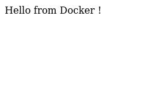

# Docker : bind mounts

Les `bind mounts` (points de montage en français) permettent de "monter" un dossier de notre ordinateur hôte à l'intérieur du conteneur.

C'est un peu comme si on branchait une clé USB contenant notre code sur le conteneur !

Les fichiers à l'intérieur de ce dossier seront donc **accessibles à la fois depuis notre ordinateur et depuis le conteneur**. Ces bind mounts sont donc très pratique pour se **créer un environnement de développement local**, mais on y reviendra.

## Créer un bind mount

On ne peut créer un bind mount qu'à la création du conteneur ! On ajoute pour cela l'argument `-v`, `--volume` ou `--mount` à notre commande `docker run`.

💡 L'argument `--mount` a une syntaxe un peu plus complexe et un fonctionnement différent des arguments `-v` ou `--volume`, nous le verrons plus tard.

Après l'argument `-v`, nous allons devoir préciser **deux chemins** séparés par le caractère `:`. Le premier chemin correspond au dossier sur l'ordinateur hôte, le second correspond à **l'emplacement dans lequel on souhaite monter le dossier**.

Par exemple, si on veut monter notre dossier `front` à l'emplacement `/usr/local/apache2/htdocs` dans notre conteneur `apache`, on va utiliser la commande suivante, **à lancer depuis la racine de ce dépôt** :

```bash
docker run -dp 8000:80 --name apache -v ./front:/usr/local/apache2/htdocs/ httpd
```

> C'est quoi, ce dossier `/usr/local/apache2/htdocs` ? 🤔

Le dossier `/usr/local/apache2/htdocs` est le `DocumentRoot` (vous vous souvenez ? on en a parlé hier !) utilisé par l'image `httpd` pour le virtual host par défaut d'Apache. En général c'est plutôt `/var/www/html`, mais dans le cas présent ce n'est pas le cas. On peut trouver cette information dans la [documentation de l'image sur le DockerHub](https://hub.docker.com/_/httpd).

Ouvrez votre navigateur et rendez-vous à l'adresse [http://localhost:8000/](http://localhost:8000/), vous devriez y trouver le frontend de notre application Pomodor'O 🎉

## Utiliser les bind mounts pour créer un environnement de dév

La favicon de notre projet n'est pas dans le bon dossier : elle est à la racine du dépôt, alors qu'elle devrait être dans le dossier `front`. Essayez de déplacer cette favicon au bon endroit, puis actualisez votre navigateur avec `Ctrl+Shift+R` (attention au cache !).

> Mais la modification est déjà visible dans le conteneur ? 😱

Hé oui ! On l'a dit tout à l'heure, avec un **bind mount**, les fichiers à l'intérieur du dossier monté sont **accessibles à la fois depuis notre ordinateur et depuis le conteneur** !

On peut donc développer sur notre VSCode, comme d'habitude, et voir les modifications en direct grâce à notre conteneur Apache ! Plus besoin d'installer Apache sur notre machine, on peut se contenter d'utiliser un conteneur Docker.

> Mais là, on a juste Apache, donc il est un peu tout nul ton environnement de dev !

Essayons de monter un environnement de développement avec Apache + PHP !

### Environnement de dév PHP

Si on cherche un peu sur le DockerHub, on va vite trouver une [image officielle PHP](https://hub.docker.com/_/php).

Quand on souhaite utiliser une image, il faut jeter un coup d'oeil à sa documentation ! On peut y lire que l'image propose différentes variantes :

- `php:<version>-cli`
- `php:<version>-apache`
- `php:<version>-fpm`
- `php:<version>-alpine`

Ah ! Ça tombe bien, l'image officielle PHP dispose donc d'une version avec Apache pré-installé & configuré, parfait !

Créeons un dossier `demo-php` à la racine de notre dépôt, puis lançons la commande suivante :

```bash
docker run -dp 8001:80 --name mon-env-de-dev-php -v ./demo-php:/var/www/html php:8.2-apache
```

💡 Je mets ici le port `8001` parce qu'on a pas stoppé notre conteneur précédent !

Une fois l'image téléchargée et le conteneur lancé, ouvrez votre navigateur à l'adresse [http://localhost:8001/](http://localhost:8001/). Vous devriez avoir une erreur `Forbidden`, c'est normal.

Créez un fichier `index.php` dans le dossier `demo-php`, et ajoutez-y le contenu suivant :

```php
<?php

echo "Hello from Docker !";
```

Actualisez la page et ...



Cet enviromment de développement est très basique : il manque par exemple le gestionnaire de dépendances Composer !

> Comment on fait, si on a besoin d'un environnement plus complexe ?

On va pouvoir se connecter à notre conteneur pour lancer des commandes à l'intérieur ! On découvre comment faire ça par [ici](./08-docker-exec.md).
